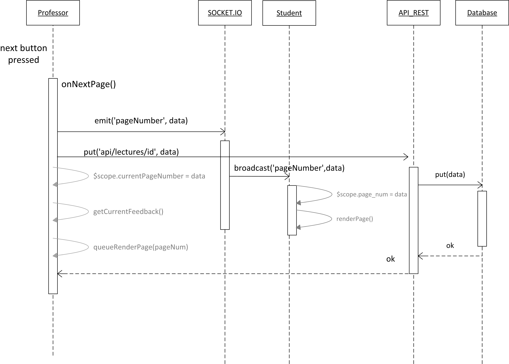

Technical Documentation
=======================

# Scaffolding :

* Yeoman
* Angular-fullstack
* Grunt
* Express
* Bower
* Mongoose

# Sequence Diagram :



# Technologies Used :

* Node.js

* AngularJS

  We used AngularJS during our project. It helped us to manipulate the DOM. For example in the chat features, each message is recupered via SocketIO and then inserted in an array. Finally Angular is used to look over the array and display each messages in a bulleted list.
  
  Controller :
  ```
  socket.socket.on('chat_msg', function (msg) {
      if (msg.lectureID === lecture_id) {
        $scope.msgReceived.push(msg);
      }
    });
  ```
  View :
  
  ```
   ul(ng-repeat='m in msgReceived', ng-init="scroll()")
      li.active
        p  {{m.hour}} &nbsp &nbsp {{m.sentBy}}: {{m.message}}
  ```

* PDFJS
 
We used PDFJS to display the pdf in the website.

  ```
var pdfDoc = null,
        pageNum = $scope.currentLecture.actualPage,
        pageRendering = false,
        pageNumPending = null,
        scale = 0.8,
        canvas = document.getElementById('the-canvas'),
        ctx = canvas.getContext('2d');

      /**
       * Get page info from document, resize canvas accordingly, and render page.
       * @param num Page number.
       */
      function renderPage(num) {
        if (pdfDoc == null) {
          return;
        }
        pageRendering = true;
        // Using promise to fetch the page
        pdfDoc.getPage(num).then(function (page) {
          var viewport = page.getViewport(scale);
          canvas.height = viewport.height;
          canvas.width = viewport.width;

          // Render PDF page into canvas context
          var renderContext = {
            canvasContext: ctx,
            viewport: viewport
          };
          var renderTask = page.render(renderContext);

          // Wait for rendering to finish
          renderTask.promise.then(function () {
            pageRendering = false;
            if (pageNumPending !== null) {
              // New page rendering is pending
              renderPage(pageNumPending);
              pageNumPending = null;
            }
          });
        });
      }

      /**
       * If another page rendering in progress, waits until the rendering is
       * finised. Otherwise, executes rendering immediately.
       */
      function queueRenderPage(num) {
        if (pageRendering) {
          pageNumPending = num;
        } else {
          renderPage(num);
        }
      }
      /**
       * Asynchronously downloads PDF.
       */
      PDFJS.getDocument(pdfUrl).then(function (pdfDoc_) {
        pdfDoc = pdfDoc_;
        document.getElementById('page_count').textContent = pdfDoc.numPages;

        // Initial/first page rendering
        renderPage(pageNum);
      });
  ```

* Socket.IO 

Socket.io was very useful to send message between the pages. Thanks to this techno we could send chat message, page number,...

It easy to use with our environnement. On the server side we specifiy the type (name) of the messages and which functions we want. (on, emit, broadcast,...). Then on the client side you can use the "emit" and "on" function to send and receive messages.

Server :
  ```
  socket.on('chat_msg', function (data) {
    //broadcasting the message to all clients
    socket.broadcast.emit('chat_msg',data);
  });
  ```
Client : 
  ```
        socket.socket.emit('chat_msg', {
        sentBy: Auth.getCurrentUser().name,
        message: $scope.chatMsg,
        hour: getTime(),
        lectureID: $scope.lecture_id
      });
  ```

* Amazon aws S3

  ```
  Insert code here
  ```
* Heroku

# Issues : 
 * ...
 * ...
 * ...
 * ...

